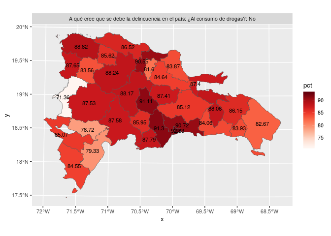

Unidad 2, asignación 1: Análisis exploratorio de datos
======================================================

Dentro de las opciones de `knitr`, en el encabezado de este archivo, es probable que encuentres el argumento `eval = F`. Antes de tejer debes cambiarlo a `eval = T`, para que evalúe los bloques de código según tus cambios.

El objetivo de esta asignación es que te familiarices con técnicas visuales y estadísticas de análisis exploratorio de datos espaciales, usando como referencia la capa de provincias dominicanas y los resultados de la Encuesta Nacional de Hogares de Propósitos Múltiples de 2017 (ENHOGAR-2017, descripción [aquí](https://www.one.gob.do/encuestas/enhogar), datos fuente [aquí](http://redatam.one.gob.do/cgibin/RpWebEngine.exe/PortalAction?&MODE=MAIN&BASE=ENH2017&MAIN=WebServerMain.inl))

Provincia asignada
------------------

Toma nota del código de tu provincia asignada aleatoriamente. Los códigos fueron tomados desde el campo `ENLACE` de la capa `PROVCenso2010` del archivo `data/divisionRD.gpkg`

``` r
 # abreviatura         ENLACE
 #       acade           0405
 #       agrie           0319
 #       aleir           0320
 #       arqco           0517
 #       cindy           0415
 #       franc           0707
 #       geora           0314
 #       hoyod           0616
 #       ingan           0306
 #       ingdi           0603
 #       itac9           0502
 #       ivanv           0808
 #       lbine           0930
 #       leona           0722
 #       magda           0604
 #       maryj           0118
 #       masue           0811
 #       mmvol           0426
 #       naui2           0929
 #       rober           0812
 #       wilne           0228
 #       yoenn           0610
```

Pregunta asignada
-----------------

Toma nota de tu pregunta asignada aleatoriamente. Cada pregunta tiene varias posibles respuestas, todas excluyentes entre sí. Por ejemplo, la pregunta: `A qué cree que se debe la delincuencia en el país: ¿A la falta de lugares para practicar deportes?` tiene las posibles respuestas `Si` (número de hogares que respondieron `Sí`) y `No` (número de hogares que respondieron `No`). Nótese que otras preguntas tienen diferentes posibles respuestas; por ejemplo, `Sexo del jefe(a) del hogar` tiene como posibles respuestas `Hombre`, `Mujer`, `Sin información`. Finalmente, nótese que cada hogar sólo podía responder una de las alternativas.

``` r
#  [1] "acade, Grupo Socio-Económico"                                                                                                                                                            
#  [2] "agrie, Principales problemas de su barrio o comunidad: ¿La educación?"                                                                                                                   
#  [3] "aleir, Principales problemas de su barrio o comunidad: ¿La salud?"                                                                                                                       
#  [4] "arqco, Principales problemas de su barrio o comunidad: ¿La acumulación de basura?"                                                                                                       
#  [5] "cindy, Principales problemas de su barrio o comunidad: ¿La corrupción?"                                                                                                                  
#  [6] "franc, A qué cree que se debe la delincuencia en el país: ¿A la falta de lugares para practicar deportes?"                                                                               
#  [7] "geora, A qué cree que se debe la delincuencia en el país: ¿Otra causa?"                                                                                                                  
#  [8] "hoyod, Principales problemas de su barrio o comunidad: ¿Otro problema?"                                                                                                                  
#  [9] "ingan, A qué cree usted que se debe la delincuencia en su barrio o comunidad: ¿Otra causa?"                                                                                              
# [10] "ingdi, Principales problemas de su barrio o comunidad: ¿El costo de la vida?"                                                                                                            
# [11] "itac9, Sexo del jefe(a) del hogar"                                                                                                                                                       
# [12] "ivanv, Principales problemas de su barrio o comunidad: ¿La delincuencia?"                                                                                                                
# [13] "lbine, Desde noviembre del año pasado hasta la fecha, ¿Alguna de las personas de este hogar tuvo un accidente de tránsito mientra conducía un vehículo, motor o bicicleta?"              
# [14] "leona, Principales problemas de su barrio o comunidad: ¿Calles, aceras y contenes en mal estado?"                                                                                        
# [15] "magda, Desde noviembre del año pasado a la fecha ¿Alguna de las personas de este hogar fue atropellada por un vehículo, motor o bicicleta mientras caminaba o estaba parada en un lugar?"
# [16] "maryj, Principales problemas de su barrio o comunidad: ¿No hay problemas en el barrio o comunidad?"                                                                                      
# [17] "masue, A qué cree usted que se debe la delincuencia en su barrio o comunidad: ¿Educación familiar/falta de valores?"                                                                     
# [18] "mmvol, Principales problemas de su barrio o comunidad: ¿La venta de drogas?"                                                                                                             
# [19] "naui2, A qué cree usted que se debe la delincuencia en su barrio o comunidad: ¿A la falta de oportunidades para estudiar?"                                                               
# [20] "rober, A qué cree usted que se debe la delincuencia en el país: ¿A la venta de drogas?"                                                                                                  
# [21] "wilne, A qué cree que se debe la delincuencia en el país: ¿A la falta de oportunidades para estudiar?"                                                                                   
# [22] "yoenn, A qué cree que se debe la delincuencia en el país: ¿Al consumo de drogas?"
```

Paquetes
--------

-   Carga el paquete `sf` y la colección `tidyverse`.

``` r
library(sf)
## Linking to GEOS 3.7.1, GDAL 2.4.2, PROJ 5.2.0
library(tidyverse)
## ── Attaching packages ───────────────────────────────────────────────────────────────────────────── tidyverse 1.2.1 ──
## ✔ ggplot2 3.2.1     ✔ purrr   0.3.3
## ✔ tibble  2.1.3     ✔ dplyr   0.8.3
## ✔ tidyr   1.0.0     ✔ stringr 1.4.0
## ✔ readr   1.3.1     ✔ forcats 0.4.0
## ── Conflicts ──────────────────────────────────────────────────────────────────────────────── tidyverse_conflicts() ──
## ✖ dplyr::filter() masks stats::filter()
## ✖ dplyr::lag()    masks stats::lag()
```

Datos y unión
-------------

El objetivo de esta sección es que puedas unir dos fuentes: el objeto espacial con los límites de las provincias, y el objeto de atributos de "ENHOGAR 2017".

-   Carga el conjunto de datos de "ENHOGAR 2017", asignándolo al objeto `en17`. Este conjunto de datos está guardado como archivo `.csv` en la carpeta `data` (único de su tipo en la carpeta).

``` r
en17 <- read.csv('data/enhogar_2017.csv', check.names = F)
```

> El argumento `check.names = F` hace que la función `read.csv` respete los espacios y caracteres especiales en los nombres de columnas.

-   Carga la capa de provincias con la función `st_read`, asignándola al objeto `prov`.

``` r
prov <- st_read(dsn = 'data/divisionRD.gpkg', layer = 'ProvCenso2010')
## Reading layer `ProvCenso2010' from data source `/home/yoenn/unidad-2-asignacion-1-esda-operaciones-con-atributos-plots-yurbaez/data/divisionRD.gpkg' using driver `GPKG'
## Simple feature collection with 32 features and 4 fields
## geometry type:  MULTIPOLYGON
## dimension:      XY
## bbox:           xmin: 182215.8 ymin: 1933532 xmax: 571365.3 ymax: 2205216
## epsg (SRID):    32619
## proj4string:    +proj=utm +zone=19 +datum=WGS84 +units=m +no_defs
```

-   Imprime los nombres de columnas de `en17` (recuerda, el nombre de un objeto en R no se rodea de comillas; las comillas sólo se usan para cadenas de caracteres)

``` r
colnames(en17)
##  [1] "Código"                                                                                                                                                                                                          
##  [2] "Provincia"                                                                                                                                                                                                       
##  [3] "Principales problemas de su barrio o comunidad: ¿La falta de energía eléctrica?: Si"                                                                                                                             
##  [4] "Principales problemas de su barrio o comunidad: ¿La falta de energía eléctrica?: No"                                                                                                                             
##  [5] "Principales problemas de su barrio o comunidad: ¿La delincuencia?: Si"                                                                                                                                           
##  [6] "Principales problemas de su barrio o comunidad: ¿La delincuencia?: No"                                                                                                                                           
##  [7] "Principales problemas de su barrio o comunidad: ¿El desempleo?: Si"                                                                                                                                              
##  [8] "Principales problemas de su barrio o comunidad: ¿El desempleo?: No"                                                                                                                                              
##  [9] "Principales problemas de su barrio o comunidad: ¿La pobreza?: Si"                                                                                                                                                
## [10] "Principales problemas de su barrio o comunidad: ¿La pobreza?: No"                                                                                                                                                
## [11] "Principales problemas de su barrio o comunidad: ¿El consumo de drogas?: Si"                                                                                                                                      
## [12] "Principales problemas de su barrio o comunidad: ¿El consumo de drogas?: No"                                                                                                                                      
## [13] "Principales problemas de su barrio o comunidad: ¿La venta de drogas?: Si"                                                                                                                                        
## [14] "Principales problemas de su barrio o comunidad: ¿La venta de drogas?: No"                                                                                                                                        
## [15] "Principales problemas de su barrio o comunidad: ¿El costo de la vida?: Si"                                                                                                                                       
## [16] "Principales problemas de su barrio o comunidad: ¿El costo de la vida?: No"                                                                                                                                       
## [17] "Principales problemas de su barrio o comunidad: ¿La corrupción?: Si"                                                                                                                                             
## [18] "Principales problemas de su barrio o comunidad: ¿La corrupción?: No"                                                                                                                                             
## [19] "Principales problemas de su barrio o comunidad: ¿La educación?: Si"                                                                                                                                              
## [20] "Principales problemas de su barrio o comunidad: ¿La educación?: No"                                                                                                                                              
## [21] "Principales problemas de su barrio o comunidad: ¿La salud?: Si"                                                                                                                                                  
## [22] "Principales problemas de su barrio o comunidad: ¿La salud?: No"                                                                                                                                                  
## [23] "Principales problemas de su barrio o comunidad: ¿La falta de agua?: Si"                                                                                                                                          
## [24] "Principales problemas de su barrio o comunidad: ¿La falta de agua?: No"                                                                                                                                          
## [25] "Principales problemas de su barrio o comunidad: ¿La acumulación de basura?: Si"                                                                                                                                  
## [26] "Principales problemas de su barrio o comunidad: ¿La acumulación de basura?: No"                                                                                                                                  
## [27] "Principales problemas de su barrio o comunidad: ¿Calles, aceras y contenes en mal estado?: Si"                                                                                                                   
## [28] "Principales problemas de su barrio o comunidad: ¿Calles, aceras y contenes en mal estado?: No"                                                                                                                   
## [29] "Principales problemas de su barrio o comunidad: ¿No hay problemas en el barrio o comunidad?: Si"                                                                                                                 
## [30] "Principales problemas de su barrio o comunidad: ¿No hay problemas en el barrio o comunidad?: No"                                                                                                                 
## [31] "Principales problemas de su barrio o comunidad: ¿Otro problema?: Si"                                                                                                                                             
## [32] "Principales problemas de su barrio o comunidad: ¿Otro problema?: No"                                                                                                                                             
## [33] "A qué cree que se debe la delincuencia en el país: ¿Al desempleo?: Si"                                                                                                                                           
## [34] "A qué cree que se debe la delincuencia en el país: ¿Al desempleo?: No"                                                                                                                                           
## [35] "A qué cree que se debe la delincuencia en el país: ¿A la pobreza?: Si"                                                                                                                                           
## [36] "A qué cree que se debe la delincuencia en el país: ¿A la pobreza?: No"                                                                                                                                           
## [37] "A qué cree que se debe la delincuencia en el país: ¿A la falta de oportunidades para estudiar?: Si"                                                                                                              
## [38] "A qué cree que se debe la delincuencia en el país: ¿A la falta de oportunidades para estudiar?: No"                                                                                                              
## [39] "A qué cree que se debe la delincuencia en el país: ¿A la falta de lugares para practicar deportes?: Si"                                                                                                          
## [40] "A qué cree que se debe la delincuencia en el país: ¿A la falta de lugares para practicar deportes?: No"                                                                                                          
## [41] "A qué cree que se debe la delincuencia en el país: ¿A la falta de alternativas sanas (clubes, cine, teatro, etc.) para el entretenimiento?: Si"                                                                  
## [42] "A qué cree que se debe la delincuencia en el país: ¿A la falta de alternativas sanas (clubes, cine, teatro, etc.) para el entretenimiento?: No"                                                                  
## [43] "A qué cree que se debe la delincuencia en el país: ¿Al consumo de drogas?: Si"                                                                                                                                   
## [44] "A qué cree que se debe la delincuencia en el país: ¿Al consumo de drogas?: No"                                                                                                                                   
## [45] "A qué cree usted que se debe la delincuencia en el país: ¿A la venta de drogas?: Si"                                                                                                                             
## [46] "A qué cree usted que se debe la delincuencia en el país: ¿A la venta de drogas?: No"                                                                                                                             
## [47] "A qué cree que se debe la delincuencia en el país: ¿Descomposición del hogar o mala crianza?: Si"                                                                                                                
## [48] "A qué cree que se debe la delincuencia en el país: ¿Descomposición del hogar o mala crianza?: No"                                                                                                                
## [49] "A qué cree que se debe la delincuencia en el país: ¿Otra causa?: Si"                                                                                                                                             
## [50] "A qué cree que se debe la delincuencia en el país: ¿Otra causa?: No"                                                                                                                                             
## [51] "A qué cree usted que se debe la delincuencia en su barrio o comunidad: ¿Al desempleo?: Si"                                                                                                                       
## [52] "A qué cree usted que se debe la delincuencia en su barrio o comunidad: ¿Al desempleo?: No"                                                                                                                       
## [53] "A qué cree usted que se debe la delincuencia en su barrio o comunidad: ¿A la pobreza?: Si"                                                                                                                       
## [54] "A qué cree usted que se debe la delincuencia en su barrio o comunidad: ¿A la pobreza?: No"                                                                                                                       
## [55] "A qué cree usted que se debe la delincuencia en su barrio o comunidad: ¿A la falta de oportunidades para estudiar?: Si"                                                                                          
## [56] "A qué cree usted que se debe la delincuencia en su barrio o comunidad: ¿A la falta de oportunidades para estudiar?: No"                                                                                          
## [57] "A qué cree usted que se debe la delincuencia en su barrio o comunidad: ¿A la falta de lugares para practicar deportes?: Si"                                                                                      
## [58] "A qué cree usted que se debe la delincuencia en su barrio o comunidad: ¿A la falta de lugares para practicar deportes?: No"                                                                                      
## [59] "A qué cree usted que se debe la delincuencia en su barrio o comunidad: ¿A la falta de alternativas sanas (clubes, cine, teatro, etc.) para el entretenimiento?: Si"                                              
## [60] "A qué cree usted que se debe la delincuencia en su barrio o comunidad: ¿A la falta de alternativas sanas (clubes, cine, teatro, etc.) para el entretenimiento?: No"                                              
## [61] "A qué cree usted que se debe la delincuencia en su barrio o comunidad: ¿Al consumo de drogas?: Si"                                                                                                               
## [62] "A qué cree usted que se debe la delincuencia en su barrio o comunidad: ¿Al consumo de drogas?: No"                                                                                                               
## [63] "A qué cree usted que se debe la delincuencia en su barrio o comunidad: ¿A la venta de drogas?: Si"                                                                                                               
## [64] "A qué cree usted que se debe la delincuencia en su barrio o comunidad: ¿A la venta de drogas?: No"                                                                                                               
## [65] "A qué cree usted que se debe la delincuencia en su barrio o comunidad: ¿Falta de educación?: Si"                                                                                                                 
## [66] "A qué cree usted que se debe la delincuencia en su barrio o comunidad: ¿Falta de educación?: No"                                                                                                                 
## [67] "A qué cree usted que se debe la delincuencia en su barrio o comunidad: ¿Falta de autoridad?: Si"                                                                                                                 
## [68] "A qué cree usted que se debe la delincuencia en su barrio o comunidad: ¿Falta de autoridad?: No"                                                                                                                 
## [69] "A qué cree usted que se debe la delincuencia en su barrio o comunidad: ¿Educación familiar/falta de valores?: Si"                                                                                                
## [70] "A qué cree usted que se debe la delincuencia en su barrio o comunidad: ¿Educación familiar/falta de valores?: No"                                                                                                
## [71] "A qué cree usted que se debe la delincuencia en su barrio o comunidad: ¿No hay delincuencia en su barrio o comunidad?: Si"                                                                                       
## [72] "A qué cree usted que se debe la delincuencia en su barrio o comunidad: ¿No hay delincuencia en su barrio o comunidad?: No"                                                                                       
## [73] "A qué cree usted que se debe la delincuencia en su barrio o comunidad: ¿Otra causa?: Si"                                                                                                                         
## [74] "A qué cree usted que se debe la delincuencia en su barrio o comunidad: ¿Otra causa?: No"                                                                                                                         
## [75] "Desde noviembre del año pasado hasta la fecha, ¿Alguna de las personas de este hogar tuvo un accidente de tránsito mientra conducía un vehículo, motor o bicicleta?: Si"                                         
## [76] "Desde noviembre del año pasado hasta la fecha, ¿Alguna de las personas de este hogar tuvo un accidente de tránsito mientra conducía un vehículo, motor o bicicleta?: No"                                         
## [77] "Desde noviembre del año pasado hasta la fecha ¿Alguna de las personas de este hogar tuvo un accidente de tránsito mientras iba en un vehículo de motor o bicicleta, conducido por otra persona?: Si"             
## [78] "Desde noviembre del año pasado hasta la fecha ¿Alguna de las personas de este hogar tuvo un accidente de tránsito mientras iba en un vehículo de motor o bicicleta, conducido por otra persona?: No"             
## [79] "Desde noviembre del año pasado hasta la fecha ¿Alguna de las personas de este hogar tuvo un accidente de tránsito mientras iba en un vehículo de motor o bicicleta, conducido por otra persona?: Sin información"
## [80] "Desde noviembre del año pasado a la fecha ¿Alguna de las personas de este hogar fue atropellada por un vehículo, motor o bicicleta mientras caminaba o estaba parada en un lugar?: Si"                           
## [81] "Desde noviembre del año pasado a la fecha ¿Alguna de las personas de este hogar fue atropellada por un vehículo, motor o bicicleta mientras caminaba o estaba parada en un lugar?: No"                           
## [82] "Desde noviembre del año pasado a la fecha ¿Alguna de las personas de este hogar fue atropellada por un vehículo, motor o bicicleta mientras caminaba o estaba parada en un lugar?: Sin información"              
## [83] "Cuántas personas de este hogar han tenido algún accidente de tránsito desde noviembre del año pasado hasta la fecha?: 0"                                                                                         
## [84] "Cuántas personas de este hogar han tenido algún accidente de tránsito desde noviembre del año pasado hasta la fecha?: 1"                                                                                         
## [85] "Cuántas personas de este hogar han tenido algún accidente de tránsito desde noviembre del año pasado hasta la fecha?: 2"                                                                                         
## [86] "Cuántas personas de este hogar han tenido algún accidente de tránsito desde noviembre del año pasado hasta la fecha?: 3"                                                                                         
## [87] "Cuántas personas de este hogar han tenido algún accidente de tránsito desde noviembre del año pasado hasta la fecha?: 4"                                                                                         
## [88] "Sexo del jefe(a) del hogar: Hombre"                                                                                                                                                                              
## [89] "Sexo del jefe(a) del hogar: Mujer"                                                                                                                                                                               
## [90] "Sexo del jefe(a) del hogar: Sin información"                                                                                                                                                                     
## [91] "Tipo de hogar: Unipersonal"                                                                                                                                                                                      
## [92] "Tipo de hogar: Nuclear"                                                                                                                                                                                          
## [93] "Tipo de hogar: Extendido"                                                                                                                                                                                        
## [94] "Tipo de hogar: Compuesto"                                                                                                                                                                                        
## [95] "Grupo Socio-Económico: Muy bajo"                                                                                                                                                                                 
## [96] "Grupo Socio-Económico: Bajo"                                                                                                                                                                                     
## [97] "Grupo Socio-Económico: Medio bajo"                                                                                                                                                                               
## [98] "Grupo Socio-Económico: Medio"                                                                                                                                                                                    
## [99] "Grupo Socio-Económico: Medio alto-Alto"
```

-   Imprime los nombres de columnas de `prov`

``` r
colnames(prov)
## [1] "PROV"      "REG"       "TOPONIMIA" "ENLACE"    "geom"
```

-   Las columnas a través de las cuales se pueden unir ambos conjuntos son `en17$Código` y `prov$ENLACE`. Sin embargo, al igual que ocurría con los datos del censo en el material de apoyo, la columna `en17$Código` no conserva los ceros a la izquierda. En este caso, dicha omisión ocurre en los códigos con 3 caracteres (los que tienen 4 caracteres están correctos). Visualiza ambas columnas para que notes la discrepancia.

``` r
en17$Código
##  [1]  109  118  125  213  224  228  306  314  319  320  405  415  426  427
## [15]  502  517  521  531  603  604  610  616  707  722  808  811  812  923
## [29]  929  930 1001 1032
prov$ENLACE
##  [1] 1001 0502 0603 0604 0405 0306 0707 0808 0109 0610 0811 0812 0213 0314
## [15] 0415 0616 0517 0118 0319 0320 0521 0722 0923 0224 0125 0426 0427 0228
## [29] 0929 0930 0531 1032
## 32 Levels: 0109 0118 0125 0213 0224 0228 0306 0314 0319 0320 0405 ... 1032
```

-   Si intentaras hacer una unión, no daría resultados apropiados. Para comprobarlo que dicha unión fallaría, utiliza la función `match`.

``` r
match(en17$Código , prov$ENLACE)
##  [1] NA NA NA NA NA NA NA NA NA NA NA NA NA NA NA NA NA NA NA NA NA NA NA
## [24] NA NA NA NA NA NA NA  1 32
```

-   Para resolver esta discrepancia, crea una columna en el objeto `en17`, mediante la cual unirás este objeto con `prov`. Es preferible que las columnas con las que se realizará la unión tengan el mismo nombre. El objeto `prov` ya tiene una columna `ENLACE` con códigos correctos, razón por la cual crearás una columna denominada `ENLACE` en `en17`, corrigiendo al mismo tiempo los ceros a la izquierda faltantes. Una forma de las formas más cómodas de resolverlo es con la función `mutate`, creando una columna nueva a partir de la columna `Código`. Para que la nueva columna contenga los ceros a la izquierda faltantes, utiliza la función de condición `ifelse`. Utiliza el material de apoyo como referencia.

``` r
en17 <- en17 %>% mutate(ENLACE = ifelse(nchar(Código)==3, paste0('0', Código), Código))
```

-   Imprime en pantalla la columna `ENLACE` creada en `en17`, e intenta ahora el `match` entre ambas columnas `ENLACE` de los dos objetos, `en17` y `prov`. Si tras ejecutar el `match` no aparecen `NA`, entonces la unión puede realizarse sin problemas.

``` r
en17$ENLACE
##  [1] "0109" "0118" "0125" "0213" "0224" "0228" "0306" "0314" "0319" "0320"
## [11] "0405" "0415" "0426" "0427" "0502" "0517" "0521" "0531" "0603" "0604"
## [21] "0610" "0616" "0707" "0722" "0808" "0811" "0812" "0923" "0929" "0930"
## [31] "1001" "1032"
match(en17$ENLACE , prov$ENLACE)
##  [1]  9 18 25 13 24 28  6 14 19 20  5 15 26 27  2 17 21 31  3  4 10 16  7
## [24] 22  8 11 12 23 29 30  1 32
```

-   Ahora haz la unión entre los conjuntos de datos `en17` y `prov` mediante la función `inner_join` usando el campo `ENLACE`, el cual existe en ambos objetos de manera consistente, siempre que hayas ejecutado bien los códigos anteriores. Asigna el resultado al objeto `proven17`, e imprímelo en pantalla.

``` r
proven17 <- prov %>% inner_join(en17, by = 'ENLACE')
## Warning: Column `ENLACE` joining factor and character vector, coercing into
## character vector
proven17
## Simple feature collection with 32 features and 103 fields
## geometry type:  MULTIPOLYGON
## dimension:      XY
## bbox:           xmin: 182215.8 ymin: 1933532 xmax: 571365.3 ymax: 2205216
## epsg (SRID):    32619
## proj4string:    +proj=utm +zone=19 +datum=WGS84 +units=m +no_defs
## First 10 features:
##    PROV REG         TOPONIMIA ENLACE Código         Provincia
## 1    01  10 DISTRITO NACIONAL   1001   1001 Distrito Nacional
## 2    02  05              AZUA   0502    502              Azua
## 3    03  06           BAORUCO   0603    603           Baoruco
## 4    04  06          BARAHONA   0604    604          Barahona
## 5    05  04           DAJABÓN   0405    405           Dajabón
## 6    06  03            DUARTE   0306    306            Duarte
## 7    07  07        ELÍAS PIÑA   0707    707        Elías Piña
## 8    08  08          EL SEIBO   0808    808          El Seibo
## 9    09  01         ESPAILLAT   0109    109         Espaillat
## 10   10  06     INDEPENDENCIA   0610    610     Independencia
##    Principales problemas de su barrio o comunidad: ¿La falta de energía eléctrica?: Si
## 1                                                                                  848
## 2                                                                                  176
## 3                                                                                  116
## 4                                                                                  366
## 5                                                                                   39
## 6                                                                                  289
## 7                                                                                   34
## 8                                                                                   24
## 9                                                                                  190
## 10                                                                                  50
##    Principales problemas de su barrio o comunidad: ¿La falta de energía eléctrica?: No
## 1                                                                                 3298
## 2                                                                                  581
## 3                                                                                  227
## 4                                                                                  322
## 5                                                                                  213
## 6                                                                                  909
## 7                                                                                  164
## 8                                                                                  301
## 9                                                                                  625
## 10                                                                                 151
##    Principales problemas de su barrio o comunidad: ¿La delincuencia?: Si
## 1                                                                   2354
## 2                                                                    183
## 3                                                                    108
## 4                                                                    245
## 5                                                                     74
## 6                                                                    696
## 7                                                                     36
## 8                                                                    108
## 9                                                                    263
## 10                                                                    57
##    Principales problemas de su barrio o comunidad: ¿La delincuencia?: No
## 1                                                                   1792
## 2                                                                    574
## 3                                                                    235
## 4                                                                    442
## 5                                                                    178
## 6                                                                    501
## 7                                                                    163
## 8                                                                    217
## 9                                                                    552
## 10                                                                   144
##    Principales problemas de su barrio o comunidad: ¿El desempleo?: Si
## 1                                                                1073
## 2                                                                 378
## 3                                                                 158
## 4                                                                 458
## 5                                                                  86
## 6                                                                 450
## 7                                                                 112
## 8                                                                 124
## 9                                                                 133
## 10                                                                 88
##    Principales problemas de su barrio o comunidad: ¿El desempleo?: No
## 1                                                                3072
## 2                                                                 380
## 3                                                                 185
## 4                                                                 230
## 5                                                                 166
## 6                                                                 748
## 7                                                                  86
## 8                                                                 201
## 9                                                                 682
## 10                                                                113
##    Principales problemas de su barrio o comunidad: ¿La pobreza?: Si
## 1                                                               381
## 2                                                               150
## 3                                                                95
## 4                                                               127
## 5                                                                35
## 6                                                               140
## 7                                                                41
## 8                                                                70
## 9                                                                46
## 10                                                               43
##    Principales problemas de su barrio o comunidad: ¿La pobreza?: No
## 1                                                              3765
## 2                                                               607
## 3                                                               248
## 4                                                               561
## 5                                                               216
## 6                                                              1057
## 7                                                               158
## 8                                                               255
## 9                                                               769
## 10                                                              158
##    Principales problemas de su barrio o comunidad: ¿El consumo de drogas?: Si
## 1                                                                         357
## 2                                                                          62
## 3                                                                          20
## 4                                                                          68
## 5                                                                          12
## 6                                                                         166
## 7                                                                          17
## 8                                                                          23
## 9                                                                          35
## 10                                                                         14
##    Principales problemas de su barrio o comunidad: ¿El consumo de drogas?: No
## 1                                                                        3788
## 2                                                                         695
## 3                                                                         324
## 4                                                                         620
## 5                                                                         239
## 6                                                                        1032
## 7                                                                         182
## 8                                                                         302
## 9                                                                         780
## 10                                                                        187
##    Principales problemas de su barrio o comunidad: ¿La venta de drogas?: Si
## 1                                                                       286
## 2                                                                        61
## 3                                                                        13
## 4                                                                        68
## 5                                                                         8
## 6                                                                       140
## 7                                                                        16
## 8                                                                        17
## 9                                                                        23
## 10                                                                       13
##    Principales problemas de su barrio o comunidad: ¿La venta de drogas?: No
## 1                                                                      3859
## 2                                                                       697
## 3                                                                       330
## 4                                                                       620
## 5                                                                       244
## 6                                                                      1058
## 7                                                                       183
## 8                                                                       307
## 9                                                                       792
## 10                                                                      188
##    Principales problemas de su barrio o comunidad: ¿El costo de la vida?: Si
## 1                                                                        475
## 2                                                                         68
## 3                                                                         55
## 4                                                                        148
## 5                                                                         33
## 6                                                                        114
## 7                                                                         32
## 8                                                                         31
## 9                                                                         32
## 10                                                                        16
##    Principales problemas de su barrio o comunidad: ¿El costo de la vida?: No
## 1                                                                       3670
## 2                                                                        690
## 3                                                                        288
## 4                                                                        539
## 5                                                                        219
## 6                                                                       1084
## 7                                                                        167
## 8                                                                        294
## 9                                                                        783
## 10                                                                       185
##    Principales problemas de su barrio o comunidad: ¿La corrupción?: Si
## 1                                                                  296
## 2                                                                   27
## 3                                                                   25
## 4                                                                   30
## 5                                                                   10
## 6                                                                   76
## 7                                                                    7
## 8                                                                   16
## 9                                                                   18
## 10                                                                   5
##    Principales problemas de su barrio o comunidad: ¿La corrupción?: No
## 1                                                                 3849
## 2                                                                  731
## 3                                                                  318
## 4                                                                  657
## 5                                                                  241
## 6                                                                 1122
## 7                                                                  191
## 8                                                                  308
## 9                                                                  797
## 10                                                                 196
##    Principales problemas de su barrio o comunidad: ¿La educación?: Si
## 1                                                                 187
## 2                                                                  26
## 3                                                                  25
## 4                                                                  34
## 5                                                                   4
## 6                                                                  57
## 7                                                                  19
## 8                                                                  18
## 9                                                                   8
## 10                                                                  5
##    Principales problemas de su barrio o comunidad: ¿La educación?: No
## 1                                                                3958
## 2                                                                 731
## 3                                                                 318
## 4                                                                 653
## 5                                                                 248
## 6                                                                1141
## 7                                                                 180
## 8                                                                 307
## 9                                                                 807
## 10                                                                196
##    Principales problemas de su barrio o comunidad: ¿La salud?: Si
## 1                                                              92
## 2                                                              41
## 3                                                              35
## 4                                                              81
## 5                                                              14
## 6                                                              43
## 7                                                              49
## 8                                                              15
## 9                                                              16
## 10                                                              9
##    Principales problemas de su barrio o comunidad: ¿La salud?: No
## 1                                                            4053
## 2                                                             716
## 3                                                             309
## 4                                                             606
## 5                                                             237
## 6                                                            1155
## 7                                                             150
## 8                                                             310
## 9                                                             799
## 10                                                            192
##    Principales problemas de su barrio o comunidad: ¿La falta de agua?: Si
## 1                                                                     912
## 2                                                                     272
## 3                                                                     130
## 4                                                                     225
## 5                                                                      49
## 6                                                                     335
## 7                                                                      52
## 8                                                                      53
## 9                                                                     251
## 10                                                                     68
##    Principales problemas de su barrio o comunidad: ¿La falta de agua?: No
## 1                                                                    3233
## 2                                                                     486
## 3                                                                     213
## 4                                                                     462
## 5                                                                     203
## 6                                                                     863
## 7                                                                     147
## 8                                                                     272
## 9                                                                     564
## 10                                                                    133
##    Principales problemas de su barrio o comunidad: ¿La acumulación de basura?: Si
## 1                                                                             386
## 2                                                                              71
## 3                                                                              40
## 4                                                                              66
## 5                                                                              19
## 6                                                                              43
## 7                                                                              11
## 8                                                                              19
## 9                                                                              15
## 10                                                                             18
##    Principales problemas de su barrio o comunidad: ¿La acumulación de basura?: No
## 1                                                                            3759
## 2                                                                             687
## 3                                                                             303
## 4                                                                             622
## 5                                                                             233
## 6                                                                            1155
## 7                                                                             188
## 8                                                                             306
## 9                                                                             800
## 10                                                                            183
##    Principales problemas de su barrio o comunidad: ¿Calles, aceras y contenes en mal estado?: Si
## 1                                                                                            212
## 2                                                                                             82
## 3                                                                                             73
## 4                                                                                             99
## 5                                                                                             53
## 6                                                                                            222
## 7                                                                                             45
## 8                                                                                             61
## 9                                                                                            199
## 10                                                                                            64
##    Principales problemas de su barrio o comunidad: ¿Calles, aceras y contenes en mal estado?: No
## 1                                                                                           3933
## 2                                                                                            675
## 3                                                                                            270
## 4                                                                                            588
## 5                                                                                            199
## 6                                                                                            975
## 7                                                                                            154
## 8                                                                                            264
## 9                                                                                            616
## 10                                                                                           137
##    Principales problemas de su barrio o comunidad: ¿No hay problemas en el barrio o comunidad?: Si
## 1                                                                                              265
## 2                                                                                               14
## 3                                                                                                1
## 4                                                                                                2
## 5                                                                                               19
## 6                                                                                                7
## 7                                                                                                5
## 8                                                                                               14
## 9                                                                                               92
## 10                                                                                               1
##    Principales problemas de su barrio o comunidad: ¿No hay problemas en el barrio o comunidad?: No
## 1                                                                                             3881
## 2                                                                                              743
## 3                                                                                              343
## 4                                                                                              686
## 5                                                                                              232
## 6                                                                                             1191
## 7                                                                                              194
## 8                                                                                              311
## 9                                                                                              723
## 10                                                                                             200
##    Principales problemas de su barrio o comunidad: ¿Otro problema?: Si
## 1                                                                  845
## 2                                                                  141
## 3                                                                   45
## 4                                                                  109
## 5                                                                   50
## 6                                                                  162
## 7                                                                   25
## 8                                                                   54
## 9                                                                  136
## 10                                                                  26
##    Principales problemas de su barrio o comunidad: ¿Otro problema?: No
## 1                                                                 3300
## 2                                                                  617
## 3                                                                  298
## 4                                                                  578
## 5                                                                  202
## 6                                                                 1036
## 7                                                                  174
## 8                                                                  271
## 9                                                                  679
## 10                                                                 175
##    A qué cree que se debe la delincuencia en el país: ¿Al desempleo?: Si
## 1                                                                   3129
## 2                                                                    570
## 3                                                                    272
## 4                                                                    576
## 5                                                                    175
## 6                                                                   1052
## 7                                                                    155
## 8                                                                    248
## 9                                                                    583
## 10                                                                   147
##    A qué cree que se debe la delincuencia en el país: ¿Al desempleo?: No
## 1                                                                   1016
## 2                                                                    187
## 3                                                                     72
## 4                                                                    111
## 5                                                                     76
## 6                                                                    146
## 7                                                                     44
## 8                                                                     77
## 9                                                                    232
## 10                                                                    54
##    A qué cree que se debe la delincuencia en el país: ¿A la pobreza?: Si
## 1                                                                    987
## 2                                                                    266
## 3                                                                    159
## 4                                                                    157
## 5                                                                     60
## 6                                                                    408
## 7                                                                     45
## 8                                                                    145
## 9                                                                    219
## 10                                                                   116
##    A qué cree que se debe la delincuencia en el país: ¿A la pobreza?: No
## 1                                                                   3158
## 2                                                                    492
## 3                                                                    184
## 4                                                                    530
## 5                                                                    192
## 6                                                                    789
## 7                                                                    154
## 8                                                                    179
## 9                                                                    596
## 10                                                                    85
##    A qué cree que se debe la delincuencia en el país: ¿A la falta de oportunidades para estudiar?: Si
## 1                                                                                                 931
## 2                                                                                                  99
## 3                                                                                                  50
## 4                                                                                                  89
## 5                                                                                                  10
## 6                                                                                                  76
## 7                                                                                                  19
## 8                                                                                                  32
## 9                                                                                                  70
## 10                                                                                                 18
##    A qué cree que se debe la delincuencia en el país: ¿A la falta de oportunidades para estudiar?: No
## 1                                                                                                3214
## 2                                                                                                 658
## 3                                                                                                 293
## 4                                                                                                 598
## 5                                                                                                 242
## 6                                                                                                1122
## 7                                                                                                 179
## 8                                                                                                 293
## 9                                                                                                 745
## 10                                                                                                183
##    A qué cree que se debe la delincuencia en el país: ¿A la falta de lugares para practicar deportes?: Si
## 1                                                                                                     163
## 2                                                                                                       8
## 3                                                                                                       5
## 4                                                                                                      12
## 5                                                                                                       2
## 6                                                                                                      14
## 7                                                                                                       3
## 8                                                                                                       3
## 9                                                                                                       8
## 10                                                                                                      1
##    A qué cree que se debe la delincuencia en el país: ¿A la falta de lugares para practicar deportes?: No
## 1                                                                                                    3982
## 2                                                                                                     750
## 3                                                                                                     338
## 4                                                                                                     675
## 5                                                                                                     250
## 6                                                                                                    1184
## 7                                                                                                     196
## 8                                                                                                     321
## 9                                                                                                     807
## 10                                                                                                    200
##    A qué cree que se debe la delincuencia en el país: ¿A la falta de alternativas sanas (clubes, cine, teatro, etc.) para el entretenimiento?: Si
## 1                                                                                                                                             173
## 2                                                                                                                                               9
## 3                                                                                                                                               5
## 4                                                                                                                                              12
## 5                                                                                                                                               3
## 6                                                                                                                                              21
## 7                                                                                                                                               6
## 8                                                                                                                                               5
## 9                                                                                                                                              11
## 10                                                                                                                                              3
##    A qué cree que se debe la delincuencia en el país: ¿A la falta de alternativas sanas (clubes, cine, teatro, etc.) para el entretenimiento?: No
## 1                                                                                                                                            3973
## 2                                                                                                                                             749
## 3                                                                                                                                             338
## 4                                                                                                                                             675
## 5                                                                                                                                             249
## 6                                                                                                                                            1177
## 7                                                                                                                                             193
## 8                                                                                                                                             320
## 9                                                                                                                                             804
## 10                                                                                                                                            198
##    A qué cree que se debe la delincuencia en el país: ¿Al consumo de drogas?: Si
## 1                                                                            297
## 2                                                                             94
## 3                                                                             73
## 4                                                                            142
## 5                                                                             31
## 6                                                                            184
## 7                                                                             57
## 8                                                                             45
## 9                                                                             77
## 10                                                                            30
##    A qué cree que se debe la delincuencia en el país: ¿Al consumo de drogas?: No
## 1                                                                           3848
## 2                                                                            663
## 3                                                                            270
## 4                                                                            545
## 5                                                                            220
## 6                                                                           1014
## 7                                                                            142
## 8                                                                            280
## 9                                                                            738
## 10                                                                           171
##    A qué cree usted que se debe la delincuencia en el país: ¿A la venta de drogas?: Si
## 1                                                                                  180
## 2                                                                                   64
## 3                                                                                   63
## 4                                                                                  110
## 5                                                                                   15
## 6                                                                                   90
## 7                                                                                   51
## 8                                                                                   29
## 9                                                                                   38
## 10                                                                                  25
##    A qué cree usted que se debe la delincuencia en el país: ¿A la venta de drogas?: No
## 1                                                                                 3965
## 2                                                                                  693
## 3                                                                                  280
## 4                                                                                  578
## 5                                                                                  237
## 6                                                                                 1108
## 7                                                                                  148
## 8                                                                                  296
## 9                                                                                  777
## 10                                                                                 176
##    A qué cree que se debe la delincuencia en el país: ¿Descomposición del hogar o mala crianza?: Si
## 1                                                                                               236
## 2                                                                                                46
## 3                                                                                                11
## 4                                                                                                44
## 5                                                                                                22
## 6                                                                                                94
## 7                                                                                                 9
## 8                                                                                                15
## 9                                                                                                61
## 10                                                                                                4
##    A qué cree que se debe la delincuencia en el país: ¿Descomposición del hogar o mala crianza?: No
## 1                                                                                              3910
## 2                                                                                               711
## 3                                                                                               332
## 4                                                                                               643
## 5                                                                                               230
## 6                                                                                              1104
## 7                                                                                               190
## 8                                                                                               310
## 9                                                                                               754
## 10                                                                                              197
##    A qué cree que se debe la delincuencia en el país: ¿Otra causa?: Si
## 1                                                                  855
## 2                                                                   89
## 3                                                                   35
## 4                                                                   79
## 5                                                                   58
## 6                                                                  121
## 7                                                                   27
## 8                                                                   45
## 9                                                                  132
## 10                                                                  10
##    A qué cree que se debe la delincuencia en el país: ¿Otra causa?: No
## 1                                                                 3290
## 2                                                                  669
## 3                                                                  308
## 4                                                                  609
## 5                                                                  194
## 6                                                                 1077
## 7                                                                  172
## 8                                                                  280
## 9                                                                  683
## 10                                                                 190
##    A qué cree usted que se debe la delincuencia en su barrio o comunidad: ¿Al desempleo?: Si
## 1                                                                                       2656
## 2                                                                                        485
## 3                                                                                        248
## 4                                                                                        564
## 5                                                                                        153
## 6                                                                                       1002
## 7                                                                                        147
## 8                                                                                        202
## 9                                                                                        500
## 10                                                                                       136
##    A qué cree usted que se debe la delincuencia en su barrio o comunidad: ¿Al desempleo?: No
## 1                                                                                       1489
## 2                                                                                        273
## 3                                                                                         95
## 4                                                                                        124
## 5                                                                                         99
## 6                                                                                        196
## 7                                                                                         52
## 8                                                                                        123
## 9                                                                                        315
## 10                                                                                        65
##    A qué cree usted que se debe la delincuencia en su barrio o comunidad: ¿A la pobreza?: Si
## 1                                                                                        946
## 2                                                                                        240
## 3                                                                                        152
## 4                                                                                        179
## 5                                                                                         55
## 6                                                                                        417
## 7                                                                                         48
## 8                                                                                        145
## 9                                                                                        208
## 10                                                                                        99
##    A qué cree usted que se debe la delincuencia en su barrio o comunidad: ¿A la pobreza?: No
## 1                                                                                       3199
## 2                                                                                        518
## 3                                                                                        191
## 4                                                                                        508
## 5                                                                                        197
## 6                                                                                        781
## 7                                                                                        151
## 8                                                                                        180
## 9                                                                                        607
## 10                                                                                       102
##    A qué cree usted que se debe la delincuencia en su barrio o comunidad: ¿A la falta de oportunidades para estudiar?: Si
## 1                                                                                                                     708
## 2                                                                                                                      79
## 3                                                                                                                      46
## 4                                                                                                                      77
## 5                                                                                                                       4
## 6                                                                                                                      66
## 7                                                                                                                      17
## 8                                                                                                                      29
## 9                                                                                                                      64
## 10                                                                                                                     14
##    A qué cree usted que se debe la delincuencia en su barrio o comunidad: ¿A la falta de oportunidades para estudiar?: No
## 1                                                                                                                    3437
## 2                                                                                                                     678
## 3                                                                                                                     297
## 4                                                                                                                     610
## 5                                                                                                                     248
## 6                                                                                                                    1132
## 7                                                                                                                     182
## 8                                                                                                                     296
## 9                                                                                                                     751
## 10                                                                                                                    187
##    A qué cree usted que se debe la delincuencia en su barrio o comunidad: ¿A la falta de lugares para practicar deportes?: Si
## 1                                                                                                                         208
## 2                                                                                                                          14
## 3                                                                                                                          12
## 4                                                                                                                          15
## 5                                                                                                                           4
## 6                                                                                                                          35
## 7                                                                                                                           6
## 8                                                                                                                          13
## 9                                                                                                                          12
## 10                                                                                                                          1
##    A qué cree usted que se debe la delincuencia en su barrio o comunidad: ¿A la falta de lugares para practicar deportes?: No
## 1                                                                                                                        3937
## 2                                                                                                                         743
## 3                                                                                                                         332
## 4                                                                                                                         672
## 5                                                                                                                         248
## 6                                                                                                                        1163
## 7                                                                                                                         193
## 8                                                                                                                         312
## 9                                                                                                                         803
## 10                                                                                                                        200
##    A qué cree usted que se debe la delincuencia en su barrio o comunidad: ¿A la falta de alternativas sanas (clubes, cine, teatro, etc.) para el entretenimiento?: Si
## 1                                                                                                                                                                 165
## 2                                                                                                                                                                   9
## 3                                                                                                                                                                   4
## 4                                                                                                                                                                  16
## 5                                                                                                                                                                   3
## 6                                                                                                                                                                  65
## 7                                                                                                                                                                  16
## 8                                                                                                                                                                   7
## 9                                                                                                                                                                  19
## 10                                                                                                                                                                  1
##    A qué cree usted que se debe la delincuencia en su barrio o comunidad: ¿A la falta de alternativas sanas (clubes, cine, teatro, etc.) para el entretenimiento?: No
## 1                                                                                                                                                                3981
## 2                                                                                                                                                                 749
## 3                                                                                                                                                                 340
## 4                                                                                                                                                                 672
## 5                                                                                                                                                                 249
## 6                                                                                                                                                                1133
## 7                                                                                                                                                                 183
## 8                                                                                                                                                                 318
## 9                                                                                                                                                                 796
## 10                                                                                                                                                                200
##    A qué cree usted que se debe la delincuencia en su barrio o comunidad: ¿Al consumo de drogas?: Si
## 1                                                                                                392
## 2                                                                                                 81
## 3                                                                                                 44
## 4                                                                                                 78
## 5                                                                                                 20
## 6                                                                                                220
## 7                                                                                                 24
## 8                                                                                                 53
## 9                                                                                                 60
## 10                                                                                                21
##    A qué cree usted que se debe la delincuencia en su barrio o comunidad: ¿Al consumo de drogas?: No
## 1                                                                                               3753
## 2                                                                                                676
## 3                                                                                                300
## 4                                                                                                610
## 5                                                                                                231
## 6                                                                                                978
## 7                                                                                                174
## 8                                                                                                271
## 9                                                                                                755
## 10                                                                                               180
##    A qué cree usted que se debe la delincuencia en su barrio o comunidad: ¿A la venta de drogas?: Si
## 1                                                                                                247
## 2                                                                                                 56
## 3                                                                                                 31
## 4                                                                                                 49
## 5                                                                                                  8
## 6                                                                                                114
## 7                                                                                                 15
## 8                                                                                                 22
## 9                                                                                                 29
## 10                                                                                                11
##    A qué cree usted que se debe la delincuencia en su barrio o comunidad: ¿A la venta de drogas?: No
## 1                                                                                               3899
## 2                                                                                                701
## 3                                                                                                312
## 4                                                                                                638
## 5                                                                                                244
## 6                                                                                               1084
## 7                                                                                                184
## 8                                                                                                303
## 9                                                                                                786
## 10                                                                                               190
##    A qué cree usted que se debe la delincuencia en su barrio o comunidad: ¿Falta de educación?: Si
## 1                                                                                              338
## 2                                                                                               16
## 3                                                                                                2
## 4                                                                                               21
## 5                                                                                                5
## 6                                                                                               16
## 7                                                                                                1
## 8                                                                                                4
## 9                                                                                               17
## 10                                                                                               1
##    A qué cree usted que se debe la delincuencia en su barrio o comunidad: ¿Falta de educación?: No
## 1                                                                                             3808
## 2                                                                                              742
## 3                                                                                              341
## 4                                                                                              667
## 5                                                                                              247
## 6                                                                                             1182
## 7                                                                                              198
## 8                                                                                              321
## 9                                                                                              798
## 10                                                                                             200
##    A qué cree usted que se debe la delincuencia en su barrio o comunidad: ¿Falta de autoridad?: Si
## 1                                                                                              121
## 2                                                                                               10
## 3                                                                                                4
## 4                                                                                               11
## 5                                                                                                6
## 6                                                                                               11
## 7                                                                                                4
## 8                                                                                                5
## 9                                                                                                8
## 10                                                                                               3
##    A qué cree usted que se debe la delincuencia en su barrio o comunidad: ¿Falta de autoridad?: No
## 1                                                                                             4024
## 2                                                                                              748
## 3                                                                                              340
## 4                                                                                              677
## 5                                                                                              246
## 6                                                                                             1187
## 7                                                                                              195
## 8                                                                                              320
## 9                                                                                              807
## 10                                                                                             198
##    A qué cree usted que se debe la delincuencia en su barrio o comunidad: ¿Educación familiar/falta de valores?: Si
## 1                                                                                                               131
## 2                                                                                                                26
## 3                                                                                                                 5
## 4                                                                                                                29
## 5                                                                                                                10
## 6                                                                                                                37
## 7                                                                                                                 7
## 8                                                                                                                 7
## 9                                                                                                                32
## 10                                                                                                                2
##    A qué cree usted que se debe la delincuencia en su barrio o comunidad: ¿Educación familiar/falta de valores?: No
## 1                                                                                                              4014
## 2                                                                                                               732
## 3                                                                                                               338
## 4                                                                                                               658
## 5                                                                                                               242
## 6                                                                                                              1161
## 7                                                                                                               192
## 8                                                                                                               317
## 9                                                                                                               783
## 10                                                                                                              199
##    A qué cree usted que se debe la delincuencia en su barrio o comunidad: ¿No hay delincuencia en su barrio o comunidad?: Si
## 1                                                                                                                        292
## 2                                                                                                                         64
## 3                                                                                                                         30
## 4                                                                                                                         31
## 5                                                                                                                         35
## 6                                                                                                                         19
## 7                                                                                                                         17
## 8                                                                                                                         16
## 9                                                                                                                         68
## 10                                                                                                                        19
##    A qué cree usted que se debe la delincuencia en su barrio o comunidad: ¿No hay delincuencia en su barrio o comunidad?: No
## 1                                                                                                                       3854
## 2                                                                                                                        693
## 3                                                                                                                        313
## 4                                                                                                                        657
## 5                                                                                                                        217
## 6                                                                                                                       1178
## 7                                                                                                                        182
## 8                                                                                                                        309
## 9                                                                                                                        747
## 10                                                                                                                       182
##    A qué cree usted que se debe la delincuencia en su barrio o comunidad: ¿Otra causa?: Si
## 1                                                                                      423
## 2                                                                                       60
## 3                                                                                       17
## 4                                                                                       36
## 5                                                                                       29
## 6                                                                                       24
## 7                                                                                        8
## 8                                                                                       20
## 9                                                                                       76
## 10                                                                                       9
##    A qué cree usted que se debe la delincuencia en su barrio o comunidad: ¿Otra causa?: No
## 1                                                                                     3723
## 2                                                                                      697
## 3                                                                                      326
## 4                                                                                      652
## 5                                                                                      223
## 6                                                                                     1174
## 7                                                                                      191
## 8                                                                                      305
## 9                                                                                      739
## 10                                                                                     192
##    Desde noviembre del año pasado hasta la fecha, ¿Alguna de las personas de este hogar tuvo un accidente de tránsito mientra conducía un vehículo, motor o bicicleta?: Si
## 1                                                                                                                                                                      204
## 2                                                                                                                                                                       43
## 3                                                                                                                                                                       15
## 4                                                                                                                                                                       29
## 5                                                                                                                                                                       18
## 6                                                                                                                                                                       55
## 7                                                                                                                                                                        7
## 8                                                                                                                                                                       18
## 9                                                                                                                                                                       57
## 10                                                                                                                                                                       8
##    Desde noviembre del año pasado hasta la fecha, ¿Alguna de las personas de este hogar tuvo un accidente de tránsito mientra conducía un vehículo, motor o bicicleta?: No
## 1                                                                                                                                                                     3941
## 2                                                                                                                                                                      715
## 3                                                                                                                                                                      328
## 4                                                                                                                                                                      659
## 5                                                                                                                                                                      234
## 6                                                                                                                                                                     1143
## 7                                                                                                                                                                      191
## 8                                                                                                                                                                      307
## 9                                                                                                                                                                      758
## 10                                                                                                                                                                     193
##    Desde noviembre del año pasado hasta la fecha ¿Alguna de las personas de este hogar tuvo un accidente de tránsito mientras iba en un vehículo de motor o bicicleta, conducido por otra persona?: Si
## 1                                                                                                                                                                                                   76
## 2                                                                                                                                                                                                   13
## 3                                                                                                                                                                                                    7
## 4                                                                                                                                                                                                   11
## 5                                                                                                                                                                                                    6
## 6                                                                                                                                                                                                   17
## 7                                                                                                                                                                                                    5
## 8                                                                                                                                                                                                    5
## 9                                                                                                                                                                                                   19
## 10                                                                                                                                                                                                   2
##    Desde noviembre del año pasado hasta la fecha ¿Alguna de las personas de este hogar tuvo un accidente de tránsito mientras iba en un vehículo de motor o bicicleta, conducido por otra persona?: No
## 1                                                                                                                                                                                                 4070
## 2                                                                                                                                                                                                  744
## 3                                                                                                                                                                                                  336
## 4                                                                                                                                                                                                  676
## 5                                                                                                                                                                                                  246
## 6                                                                                                                                                                                                 1181
## 7                                                                                                                                                                                                  193
## 8                                                                                                                                                                                                  320
## 9                                                                                                                                                                                                  796
## 10                                                                                                                                                                                                 199
##    Desde noviembre del año pasado hasta la fecha ¿Alguna de las personas de este hogar tuvo un accidente de tránsito mientras iba en un vehículo de motor o bicicleta, conducido por otra persona?: Sin información
## 1                                                                                                                                                                                                                 0
## 2                                                                                                                                                                                                                 0
## 3                                                                                                                                                                                                                 0
## 4                                                                                                                                                                                                                 0
## 5                                                                                                                                                                                                                 0
## 6                                                                                                                                                                                                                 0
## 7                                                                                                                                                                                                                 0
## 8                                                                                                                                                                                                                 0
## 9                                                                                                                                                                                                                 0
## 10                                                                                                                                                                                                                0
##    Desde noviembre del año pasado a la fecha ¿Alguna de las personas de este hogar fue atropellada por un vehículo, motor o bicicleta mientras caminaba o estaba parada en un lugar?: Si
## 1                                                                                                                                                                                     82
## 2                                                                                                                                                                                      5
## 3                                                                                                                                                                                      2
## 4                                                                                                                                                                                      3
## 5                                                                                                                                                                                      2
## 6                                                                                                                                                                                     15
## 7                                                                                                                                                                                      1
## 8                                                                                                                                                                                      6
## 9                                                                                                                                                                                      6
## 10                                                                                                                                                                                     3
##    Desde noviembre del año pasado a la fecha ¿Alguna de las personas de este hogar fue atropellada por un vehículo, motor o bicicleta mientras caminaba o estaba parada en un lugar?: No
## 1                                                                                                                                                                                   4064
## 2                                                                                                                                                                                    753
## 3                                                                                                                                                                                    341
## 4                                                                                                                                                                                    684
## 5                                                                                                                                                                                    250
## 6                                                                                                                                                                                   1182
## 7                                                                                                                                                                                    198
## 8                                                                                                                                                                                    319
## 9                                                                                                                                                                                    809
## 10                                                                                                                                                                                   198
##    Desde noviembre del año pasado a la fecha ¿Alguna de las personas de este hogar fue atropellada por un vehículo, motor o bicicleta mientras caminaba o estaba parada en un lugar?: Sin información
## 1                                                                                                                                                                                                   0
## 2                                                                                                                                                                                                   0
## 3                                                                                                                                                                                                   0
## 4                                                                                                                                                                                                   0
## 5                                                                                                                                                                                                   0
## 6                                                                                                                                                                                                   0
## 7                                                                                                                                                                                                   0
## 8                                                                                                                                                                                                   0
## 9                                                                                                                                                                                                   0
## 10                                                                                                                                                                                                  0
##    Cuántas personas de este hogar han tenido algún accidente de tránsito desde noviembre del año pasado hasta la fecha?: 0
## 1                                                                                                                     3812
## 2                                                                                                                      700
## 3                                                                                                                      321
## 4                                                                                                                      648
## 5                                                                                                                      228
## 6                                                                                                                     1126
## 7                                                                                                                      186
## 8                                                                                                                      298
## 9                                                                                                                      736
## 10                                                                                                                     190
##    Cuántas personas de este hogar han tenido algún accidente de tránsito desde noviembre del año pasado hasta la fecha?: 1
## 1                                                                                                                      290
## 2                                                                                                                       53
## 3                                                                                                                       20
## 4                                                                                                                       37
## 5                                                                                                                       22
## 6                                                                                                                       58
## 7                                                                                                                       12
## 8                                                                                                                       23
## 9                                                                                                                       70
## 10                                                                                                                      11
##    Cuántas personas de este hogar han tenido algún accidente de tránsito desde noviembre del año pasado hasta la fecha?: 2
## 1                                                                                                                       34
## 2                                                                                                                        3
## 3                                                                                                                        1
## 4                                                                                                                        3
## 5                                                                                                                        1
## 6                                                                                                                       13
## 7                                                                                                                        1
## 8                                                                                                                        3
## 9                                                                                                                        8
## 10                                                                                                                       0
##    Cuántas personas de este hogar han tenido algún accidente de tránsito desde noviembre del año pasado hasta la fecha?: 3
## 1                                                                                                                        9
## 2                                                                                                                        1
## 3                                                                                                                        1
## 4                                                                                                                        0
## 5                                                                                                                        0
## 6                                                                                                                        0
## 7                                                                                                                        0
## 8                                                                                                                        0
## 9                                                                                                                        1
## 10                                                                                                                       0
##    Cuántas personas de este hogar han tenido algún accidente de tránsito desde noviembre del año pasado hasta la fecha?: 4
## 1                                                                                                                        0
## 2                                                                                                                        0
## 3                                                                                                                        0
## 4                                                                                                                        0
## 5                                                                                                                        0
## 6                                                                                                                        0
## 7                                                                                                                        0
## 8                                                                                                                        0
## 9                                                                                                                        0
## 10                                                                                                                       0
##    Sexo del jefe(a) del hogar: Hombre Sexo del jefe(a) del hogar: Mujer
## 1                                1532                              2485
## 2                                 289                               429
## 3                                 141                               165
## 4                                 278                               366
## 5                                 103                               135
## 6                                 508                               615
## 7                                  83                                91
## 8                                 105                               195
## 9                                 317                               443
## 10                                 95                                88
##    Sexo del jefe(a) del hogar: Sin información Tipo de hogar: Unipersonal
## 1                                            0                        673
## 2                                            0                        116
## 3                                            0                         58
## 4                                            0                        119
## 5                                            0                         51
## 6                                            0                        238
## 7                                            0                         32
## 8                                            0                         74
## 9                                            0                        138
## 10                                           0                         47
##    Tipo de hogar: Nuclear Tipo de hogar: Extendido
## 1                    2122                     1042
## 2                     365                      233
## 3                     139                      117
## 4                     315                      214
## 5                     120                       64
## 6                     613                      321
## 7                      97                       56
## 8                     154                       82
## 9                     435                      193
## 10                     89                       50
##    Tipo de hogar: Compuesto Grupo Socio-Económico: Muy bajo
## 1                       309                             102
## 2                        44                              82
## 3                        29                              67
## 4                        39                             105
## 5                        17                              25
## 6                        26                              53
## 7                        15                              69
## 8                        15                              39
## 9                        48                              33
## 10                       14                              39
##    Grupo Socio-Económico: Bajo Grupo Socio-Económico: Medio bajo
## 1                          360                              1078
## 2                          206                               350
## 3                           82                               139
## 4                          208                               241
## 5                           44                               104
## 6                          202                               442
## 7                           58                                56
## 8                           63                               136
## 9                          125                               302
## 10                          47                                77
##    Grupo Socio-Económico: Medio Grupo Socio-Económico: Medio alto-Alto
## 1                          1560                                   1046
## 2                           102                                     18
## 3                            43                                     11
## 4                            98                                     35
## 5                            62                                     17
## 6                           388                                    113
## 7                            13                                      2
## 8                            69                                     17
## 9                           252                                    104
## 10                           33                                      4
##                              geom
## 1  MULTIPOLYGON (((406845.9 20...
## 2  MULTIPOLYGON (((322129.5 20...
## 3  MULTIPOLYGON (((271940 2060...
## 4  MULTIPOLYGON (((291856.5 20...
## 5  MULTIPOLYGON (((245433.3 21...
## 6  MULTIPOLYGON (((374434.8 21...
## 7  MULTIPOLYGON (((235630.8 21...
## 8  MULTIPOLYGON (((523436.4 20...
## 9  MULTIPOLYGON (((385993.5 21...
## 10 MULTIPOLYGON (((205698.2 20...
```

-   Genera un mapa con los resultados de tu pregunta para todo el país, usando la función `plot`.

> Un ejemplo ilustra cómo hacerlo. Supongamos el caso del estudiante ficticio `hoyod`. Para extraer su pregunta, el `hoyod` utiliza el operador `%>%`, la función `dplyr::select` y la función `contains`. Nota que este bloque de código de ejemplo, y los siguientes del alumno ficticio, están marcados como `eval=F`, para así evitar que generen resultados.

``` r
proven17 %>%
  dplyr::select(contains('Principales problemas de su barrio o comunidad: ¿Otro problema?')) %>%
  plot(breaks = 'jenks')
```

**Tu turno**

``` r
proven17 %>%
  dplyr::select(contains('A qué cree que se debe la delincuencia en el país: ¿Al consumo de drogas?')) %>%
  plot(breaks = 'jenks')
```


-   Genera un mapa con los resultados de tu pregunta para todo el país, usando la función `geom_sf` del paquete `ggplot2`, colocando como rótulos los valores de cada provincia. Genera otro mapa colocando los nombres de las provincias.

> El ejemplo del estudiante `hoyod` ilustra cómo hacerlo. Observa tres detalles:

> -   La paleta utilizada es `brewer.pal` del paquete `RColorBrewer`, define gradientes apropiados para la representación. Si escribe en la consola `RColorBrewer::display.brewer.all()`, se desplegarán todas las posibles paletas del paquete.
> -   Puedes definir el tamaño de la letra de los mapas. En el ejemplo, verás que se configuran dos tipos de letra mediante `size`: 1) La letra de los títulos de cada gráfico y la leyenda, en `theme(text = element_text(size = X))`; 2) Los rótulos de mapa en `geom_sf_text(..., size = X)`.
> -   La tabla de visulización de colores para el relleno usa escala logarítmica, y la define el argumento `trans = 'log10'`. Puedes "jugar" quitando dicho argumento, y notarás que los patrones se esconden, o que las provincias que destacan son sólo aquellas con valores extremos.

``` r
#Rótulos: valor de la variable
proven17 %>%
  dplyr::select(contains('Principales problemas de su barrio o comunidad: ¿Otro problema?')) %>%
  gather(variable, valor, -geom) %>% 
  ggplot() + aes(fill = valor) + geom_sf(lwd = 0.2) +
  facet_wrap(~variable) + theme(text = element_text(size = 10)) +
  scale_fill_gradientn(colours = RColorBrewer::brewer.pal(9, name = 'Reds'), trans = 'log10') +
  geom_sf_text(aes(label=valor), check_overlap = T, size = 3)

#Rótulos: nombres de las provincias
proven17 %>%
  dplyr::select(contains('Principales problemas de su barrio o comunidad: ¿Otro problema?'), TOPONIMIA) %>%
  gather(variable, valor, -geom, -TOPONIMIA) %>% 
  ggplot() + aes(fill = valor) + geom_sf(lwd = 0.2) +
  facet_wrap(~variable) + theme(text = element_text(size = 10)) +
  scale_fill_gradientn(colours = RColorBrewer::brewer.pal(9, name = 'Reds'), trans = 'log10') +
  geom_sf_text(aes(label=TOPONIMIA), check_overlap = T, size = 3)
```

**Tu turno**

``` r
#Rótulos: valor de la variable
proven17 %>%
  dplyr::select(contains('A qué cree que se debe la delincuencia en el país: ¿Al consumo de drogas?')) %>%
  gather(variable, valor, -geom) %>% 
  ggplot() + aes(fill = valor) + geom_sf(lwd = 0.2) +
  facet_wrap(~variable) + theme(text = element_text(size = 10)) +
  scale_fill_gradientn(colours = RColorBrewer::brewer.pal(9, name = 'Reds'), trans = 'log10') +
  geom_sf_text(aes(label=valor), check_overlap = T, size = 3)
```


``` r

#Rótulos: nombres de las provincias
proven17 %>%
  dplyr::select(contains('A qué cree que se debe la delincuencia en el país: ¿Al consumo de drogas?'), TOPONIMIA) %>%
  gather(variable, valor, -geom, -TOPONIMIA) %>% 
  ggplot() + aes(fill = valor) + geom_sf(lwd = 0.2) +
  facet_wrap(~variable) + theme(text = element_text(size = 10)) +
  scale_fill_gradientn(colours = RColorBrewer::brewer.pal(9, name = 'Reds'), trans = 'log10') +
  geom_sf_text(aes(label=TOPONIMIA), check_overlap = T, size = 3)
```


-   Imprime una tabla, sin columna geométrica, mostrando las respuestas a tu pregunta para todo el país, incluyendo la columna `TOPONIMIA`.

> Un ejemplo ilustra el caso del estudiante `hoyod`:

``` r
proven17 %>% st_drop_geometry() %>%
  dplyr::select(TOPONIMIA, contains('Principales problemas de su barrio o comunidad: ¿Otro problema?'))
```

**Tu turno**

``` r
proven17 %>% st_drop_geometry() %>%
  dplyr::select(TOPONIMIA, contains('A qué cree que se debe la delincuencia en el país: ¿Al consumo de drogas?'))
##                 TOPONIMIA
## 1       DISTRITO NACIONAL
## 2                    AZUA
## 3                 BAORUCO
## 4                BARAHONA
## 5                 DAJABÓN
## 6                  DUARTE
## 7              ELÍAS PIÑA
## 8                EL SEIBO
## 9               ESPAILLAT
## 10          INDEPENDENCIA
## 11          LA ALTAGRACIA
## 12              LA ROMANA
## 13                LA VEGA
## 14 MARÍA TRINIDAD SÁNCHEZ
## 15           MONTE CRISTI
## 16             PEDERNALES
## 17                PERAVIA
## 18           PUERTO PLATA
## 19       HERMANAS MIRABAL
## 20                 SAMANÁ
## 21          SAN CRISTÓBAL
## 22               SAN JUAN
## 23   SAN PEDRO DE MACORÍS
## 24        SANCHEZ RAMÍREZ
## 25               SANTIAGO
## 26     SANTIAGO RODRÍGUEZ
## 27               VALVERDE
## 28         MONSEÑOR NOUEL
## 29            MONTE PLATA
## 30             HATO MAYOR
## 31       SAN JOSÉ DE OCOA
## 32          SANTO DOMINGO
##    A qué cree que se debe la delincuencia en el país: ¿Al consumo de drogas?: Si
## 1                                                                            297
## 2                                                                             94
## 3                                                                             73
## 4                                                                            142
## 5                                                                             31
## 6                                                                            184
## 7                                                                             57
## 8                                                                             45
## 9                                                                             77
## 10                                                                            30
## 11                                                                           218
## 12                                                                           166
## 13                                                                           180
## 14                                                                            91
## 15                                                                            51
## 16                                                                            17
## 17                                                                            79
## 18                                                                           176
## 19                                                                            60
## 20                                                                            47
## 21                                                                           168
## 22                                                                           102
## 23                                                                           200
## 24                                                                            71
## 25                                                                           473
## 26                                                                            37
## 27                                                                           105
## 28                                                                            57
## 29                                                                            96
## 30                                                                            43
## 31                                                                            34
## 32                                                                           849
##    A qué cree que se debe la delincuencia en el país: ¿Al consumo de drogas?: No
## 1                                                                           3848
## 2                                                                            663
## 3                                                                            270
## 4                                                                            545
## 5                                                                            220
## 6                                                                           1014
## 7                                                                            142
## 8                                                                            280
## 9                                                                            738
## 10                                                                           171
## 11                                                                          1040
## 12                                                                           867
## 13                                                                          1342
## 14                                                                           473
## 15                                                                           405
## 16                                                                            93
## 17                                                                           568
## 18                                                                          1130
## 19                                                                           266
## 20                                                                           326
## 21                                                                          1762
## 22                                                                           716
## 23                                                                          1055
## 24                                                                           493
## 25                                                                          3548
## 26                                                                           188
## 27                                                                           625
## 28                                                                           584
## 29                                                                           549
## 30                                                                           317
## 31                                                                           208
## 32                                                                          8298
```

-   Imprime una tabla, sin columna geométrica, mostrando los porcentajes de cada respuesta a tu pregunta para todo el país, incluyendo la columna `TOPONIMIA` y relativizando las respuestas para cada provincia.

> Un ejemplo ilustra el caso del estudiante `hoyod`. Tres operaciones son clave en este proceso: 1) `gather` que reúne sólo las columnas numéricas, sin la de nombres de provincias (por eso verás `-TOPONIMIA`). 2) Las funciones `mutate` y `spread`, la primera genera el porcentaje por provincias, y la segunda distribuye los datos por columnas. 3) La función `kable`, del paquete `kableExtra`, genera una tabla en formato HTML, más organizada y legible que el resultado que devuelve la consola.

``` r
proven17 %>% st_drop_geometry() %>%
  dplyr::select(TOPONIMIA, contains('Principales problemas de su barrio o comunidad: ¿Otro problema?')) %>% 
  gather(variable, valor, -TOPONIMIA) %>% group_by(TOPONIMIA) %>%
  mutate(pct=round(valor/sum(valor)*100,2)) %>% dplyr::select(-valor) %>%
  spread(variable, pct) %>% kableExtra::kable()
```

**Tu turno**

``` r
proven17 %>% st_drop_geometry() %>%
  dplyr::select(TOPONIMIA, contains('A qué cree que se debe la delincuencia en el país: ¿Al consumo de drogas?')) %>% 
  gather(variable, valor, -TOPONIMIA) %>% group_by(TOPONIMIA) %>%
  mutate(pct=round(valor/sum(valor)*100,2)) %>% dplyr::select(-valor) %>%
  spread(variable, pct) %>% kableExtra::kable()
```

<table>
<thead>
<tr>
<th style="text-align:left;">
TOPONIMIA
</th>
<th style="text-align:right;">
A qué cree que se debe la delincuencia en el país: ¿Al consumo de drogas?: No
</th>
<th style="text-align:right;">
A qué cree que se debe la delincuencia en el país: ¿Al consumo de drogas?: Si
</th>
</tr>
</thead>
<tbody>
<tr>
<td style="text-align:left;">
AZUA
</td>
<td style="text-align:right;">
87.58
</td>
<td style="text-align:right;">
12.42
</td>
</tr>
<tr>
<td style="text-align:left;">
BAORUCO
</td>
<td style="text-align:right;">
78.72
</td>
<td style="text-align:right;">
21.28
</td>
</tr>
<tr>
<td style="text-align:left;">
BARAHONA
</td>
<td style="text-align:right;">
79.33
</td>
<td style="text-align:right;">
20.67
</td>
</tr>
<tr>
<td style="text-align:left;">
DAJABÓN
</td>
<td style="text-align:right;">
87.65
</td>
<td style="text-align:right;">
12.35
</td>
</tr>
<tr>
<td style="text-align:left;">
DISTRITO NACIONAL
</td>
<td style="text-align:right;">
92.83
</td>
<td style="text-align:right;">
7.17
</td>
</tr>
<tr>
<td style="text-align:left;">
DUARTE
</td>
<td style="text-align:right;">
84.64
</td>
<td style="text-align:right;">
15.36
</td>
</tr>
<tr>
<td style="text-align:left;">
EL SEIBO
</td>
<td style="text-align:right;">
86.15
</td>
<td style="text-align:right;">
13.85
</td>
</tr>
<tr>
<td style="text-align:left;">
ELÍAS PIÑA
</td>
<td style="text-align:right;">
71.36
</td>
<td style="text-align:right;">
28.64
</td>
</tr>
<tr>
<td style="text-align:left;">
ESPAILLAT
</td>
<td style="text-align:right;">
90.55
</td>
<td style="text-align:right;">
9.45
</td>
</tr>
<tr>
<td style="text-align:left;">
HATO MAYOR
</td>
<td style="text-align:right;">
88.06
</td>
<td style="text-align:right;">
11.94
</td>
</tr>
<tr>
<td style="text-align:left;">
HERMANAS MIRABAL
</td>
<td style="text-align:right;">
81.60
</td>
<td style="text-align:right;">
18.40
</td>
</tr>
<tr>
<td style="text-align:left;">
INDEPENDENCIA
</td>
<td style="text-align:right;">
85.07
</td>
<td style="text-align:right;">
14.93
</td>
</tr>
<tr>
<td style="text-align:left;">
LA ALTAGRACIA
</td>
<td style="text-align:right;">
82.67
</td>
<td style="text-align:right;">
17.33
</td>
</tr>
<tr>
<td style="text-align:left;">
LA ROMANA
</td>
<td style="text-align:right;">
83.93
</td>
<td style="text-align:right;">
16.07
</td>
</tr>
<tr>
<td style="text-align:left;">
LA VEGA
</td>
<td style="text-align:right;">
88.17
</td>
<td style="text-align:right;">
11.83
</td>
</tr>
<tr>
<td style="text-align:left;">
MARÍA TRINIDAD SÁNCHEZ
</td>
<td style="text-align:right;">
83.87
</td>
<td style="text-align:right;">
16.13
</td>
</tr>
<tr>
<td style="text-align:left;">
MONSEÑOR NOUEL
</td>
<td style="text-align:right;">
91.11
</td>
<td style="text-align:right;">
8.89
</td>
</tr>
<tr>
<td style="text-align:left;">
MONTE CRISTI
</td>
<td style="text-align:right;">
88.82
</td>
<td style="text-align:right;">
11.18
</td>
</tr>
<tr>
<td style="text-align:left;">
MONTE PLATA
</td>
<td style="text-align:right;">
85.12
</td>
<td style="text-align:right;">
14.88
</td>
</tr>
<tr>
<td style="text-align:left;">
PEDERNALES
</td>
<td style="text-align:right;">
84.55
</td>
<td style="text-align:right;">
15.45
</td>
</tr>
<tr>
<td style="text-align:left;">
PERAVIA
</td>
<td style="text-align:right;">
87.79
</td>
<td style="text-align:right;">
12.21
</td>
</tr>
<tr>
<td style="text-align:left;">
PUERTO PLATA
</td>
<td style="text-align:right;">
86.52
</td>
<td style="text-align:right;">
13.48
</td>
</tr>
<tr>
<td style="text-align:left;">
SAMANÁ
</td>
<td style="text-align:right;">
87.40
</td>
<td style="text-align:right;">
12.60
</td>
</tr>
<tr>
<td style="text-align:left;">
SAN CRISTÓBAL
</td>
<td style="text-align:right;">
91.30
</td>
<td style="text-align:right;">
8.70
</td>
</tr>
<tr>
<td style="text-align:left;">
SAN JOSÉ DE OCOA
</td>
<td style="text-align:right;">
85.95
</td>
<td style="text-align:right;">
14.05
</td>
</tr>
<tr>
<td style="text-align:left;">
SAN JUAN
</td>
<td style="text-align:right;">
87.53
</td>
<td style="text-align:right;">
12.47
</td>
</tr>
<tr>
<td style="text-align:left;">
SAN PEDRO DE MACORÍS
</td>
<td style="text-align:right;">
84.06
</td>
<td style="text-align:right;">
15.94
</td>
</tr>
<tr>
<td style="text-align:left;">
SANCHEZ RAMÍREZ
</td>
<td style="text-align:right;">
87.41
</td>
<td style="text-align:right;">
12.59
</td>
</tr>
<tr>
<td style="text-align:left;">
SANTIAGO
</td>
<td style="text-align:right;">
88.24
</td>
<td style="text-align:right;">
11.76
</td>
</tr>
<tr>
<td style="text-align:left;">
SANTIAGO RODRÍGUEZ
</td>
<td style="text-align:right;">
83.56
</td>
<td style="text-align:right;">
16.44
</td>
</tr>
<tr>
<td style="text-align:left;">
SANTO DOMINGO
</td>
<td style="text-align:right;">
90.72
</td>
<td style="text-align:right;">
9.28
</td>
</tr>
<tr>
<td style="text-align:left;">
VALVERDE
</td>
<td style="text-align:right;">
85.62
</td>
<td style="text-align:right;">
14.38
</td>
</tr>
</tbody>
</table>
-   Genera un mapa con los porcentajes de respuestas de tu pregunta para todo el país, usando la función `geom_sf` del paquete `ggplot2`; coloca como rótulos los porcentajes para cada provincia.

> Ejemplo del estudiante `hoyod`:

``` r
proven17 %>%
  dplyr::select(contains('Principales problemas de su barrio o comunidad: ¿Otro problema?'), TOPONIMIA) %>%
  gather(variable, valor, -geom, -TOPONIMIA) %>% 
  group_by(TOPONIMIA) %>% 
  mutate(pct=round(valor/sum(valor)*100,2)) %>% dplyr::select(-valor) %>% 
  ggplot() + aes(fill = pct) + geom_sf(lwd = 0.2) +
  facet_wrap(~variable) + theme(text = element_text(size = 10)) +
  scale_fill_gradientn(colours = RColorBrewer::brewer.pal(9, name = 'Reds')) +
  geom_sf_text(aes(label=pct), check_overlap = T, size = 3)
```

**Tu turno**

``` r
proven17 %>%
  dplyr::select(contains('A qué cree que se debe la delincuencia en el país: ¿Al consumo de drogas?'), TOPONIMIA) %>%
  gather(variable, valor, -geom, -TOPONIMIA) %>% 
  group_by(TOPONIMIA) %>% 
  mutate(pct=round(valor/sum(valor)*100,2)) %>% dplyr::select(-valor) %>% 
  ggplot() + aes(fill = pct) + geom_sf(lwd = 0.2) +
  facet_wrap(~variable) + theme(text = element_text(size = 10)) +
  scale_fill_gradientn(colours = RColorBrewer::brewer.pal(9, name = 'Reds')) +
  geom_sf_text(aes(label=pct), check_overlap = T, size = 3)
```


-   Repite el mandato anterior, pero usando sólo una de las posibles respuestas de tu pregunta. Elige una, la que prefieras.

> Un ejemplo ilustra mejor. En el caso del estudiante ficticio, las respuestas de la encuesta eran 'Sí' y 'No', por lo tanto, el estudiante ficticio disponde de las columnas `Principales problemas de su barrio o comunidad: ¿Otro problema?: Si` y `Principales problemas de su barrio o comunidad: ¿Otro problema?: No`. Elijamos la segunda opción (el truco está en la función `filter`):

``` r
proven17 %>%
  dplyr::select(contains('Principales problemas de su barrio o comunidad: ¿Otro problema?'), TOPONIMIA) %>%
  gather(variable, valor, -geom, -TOPONIMIA) %>% 
  group_by(TOPONIMIA) %>% 
  mutate(pct=round(valor/sum(valor)*100,2)) %>% dplyr::select(-valor) %>% 
  filter(variable %in% 'Principales problemas de su barrio o comunidad: ¿Otro problema?: No') %>% 
  ggplot() + aes(fill = pct) + geom_sf(lwd = 0.2) +
  facet_wrap(~variable) + theme(text = element_text(size = 10)) +
  scale_fill_gradientn(colours = RColorBrewer::brewer.pal(9, name = 'Reds')) +
  geom_sf_text(aes(label=pct), check_overlap = T, size = 3)
```

**Tu turno**

``` r
proven17 %>%
  dplyr::select(contains('A qué cree que se debe la delincuencia en el país: ¿Al consumo de drogas?'), TOPONIMIA) %>%
  gather(variable, valor, -geom, -TOPONIMIA) %>% 
  group_by(TOPONIMIA) %>% 
  mutate(pct=round(valor/sum(valor)*100,2)) %>% dplyr::select(-valor) %>% 
  filter(variable %in% 'A qué cree que se debe la delincuencia en el país: ¿Al consumo de drogas?: No') %>% 
  ggplot() + aes(fill = pct) + geom_sf(lwd = 0.2) +
  facet_wrap(~variable) + theme(text = element_text(size = 10)) +
  scale_fill_gradientn(colours = RColorBrewer::brewer.pal(9, name = 'Reds')) +
  geom_sf_text(aes(label=pct), check_overlap = T, size = 3)
```



-   Imprime un resumen estadístico (mínimo, primer cuartil, mediana, media, tercer cuartil, máximo) de las respuestas a tu pregunta para todo el país.

> Un ejemplo ilustra el caso del estudiante `hoyod`:

``` r
proven17 %>% st_drop_geometry() %>%
  dplyr::select(contains('Principales problemas de su barrio o comunidad: ¿Otro problema?')) %>% 
  summary
```

**Tu turno**

``` r
proven17 %>% st_drop_geometry() %>%
  dplyr::select(contains('A qué cree que se debe la delincuencia en el país: ¿Al consumo de drogas?')) %>% 
  summary
##  A qué cree que se debe la delincuencia en el país: ¿Al consumo de drogas?: Si
##  Min.   : 17.0                                                                
##  1st Qu.: 50.0                                                                
##  Median : 85.0                                                                
##  Mean   :135.9                                                                
##  3rd Qu.:170.0                                                                
##  Max.   :849.0                                                                
##  A qué cree que se debe la delincuencia en el país: ¿Al consumo de drogas?: No
##  Min.   :  93.0                                                               
##  1st Qu.: 277.5                                                               
##  Median : 558.5                                                               
##  Mean   :1023.2                                                               
##  3rd Qu.:1020.5                                                               
##  Max.   :8298.0
```

-   Genera un histograma para cada respuesta posible de tu pregunta:

> Ejemplo de `hoyod` (la clave aquí es el `facet_grid`):

``` r
proven17 %>% st_drop_geometry() %>%
  dplyr::select(contains('Principales problemas de su barrio o comunidad: ¿Otro problema?')) %>%
  select_if(is.numeric) %>% gather(variable, valor) %>%
  ggplot + aes(x=valor) %>% geom_histogram(bins=5) +
  facet_grid(~variable)
```

**Tu turno** (Tip: edita el argumento `bins` dentro de la función `geom_histogram` para adaptarlo a tus datos)

``` r
proven17 %>% st_drop_geometry() %>%
  dplyr::select(contains('A qué cree que se debe la delincuencia en el país: ¿Al consumo de drogas?')) %>%
  select_if(is.numeric) %>%  gather(variable, valor) %>%
  ggplot + aes(x=valor) %>% geom_histogram(bins=10) +
  scale_x_continuous(trans = 'log1p') + facet_grid(~variable)
```


-   Genera un histograma con escala logarítmica para cada respuesta posible de tu pregunta:

> Ejemplo de `hoyod`:

``` r
proven17 %>% st_drop_geometry() %>%
  dplyr::select(contains('Principales problemas de su barrio o comunidad: ¿Otro problema?')) %>%
  select_if(is.numeric) %>% gather(variable, valor) %>%
  ggplot + aes(x=valor) %>% geom_histogram(bins=10) +
  scale_x_continuous(trans = 'log1p') + facet_grid(~variable)
```

**Tu turno** (Tip: edita el argumento `bins` dentro de la función `geom_histogram` para adaptarlo a tus datos)

``` r
proven17 %>% st_drop_geometry() %>%
  dplyr::select(contains('A qué cree que se debe la delincuencia en el país: ¿Al consumo de drogas?')) %>%
  select_if(is.numeric) %>%  gather(variable, valor) %>%
  ggplot + aes(x=valor) %>% geom_histogram(bins=5) +
  scale_x_continuous(trans = 'log1p') + facet_grid(~variable)
```


-   Genera un gráfico de barras en modo *dodge*, es decir, barras una al lado de la otra, y barras apiladas

> Ejemplo de `hoyod`:

``` r
#Barras una al lado de la otra (position = 'dodge')
proven17 %>%
  st_drop_geometry() %>%
  dplyr::select(contains('Principales problemas de su barrio o comunidad: ¿Otro problema?'), TOPONIMIA) %>%
  gather(variable, valor, -TOPONIMIA) %>%
  ggplot() + aes(x = TOPONIMIA, y = valor, fill = variable, group = variable) +
  geom_col(position = 'dodge') + scale_y_continuous() +
  theme(axis.text.x = element_text(angle = 90), text = element_text(size = 12)) + coord_flip()

#Barras apiladas (position = 'fill')
proven17 %>%
  st_drop_geometry() %>%
  dplyr::select(contains('Principales problemas de su barrio o comunidad: ¿Otro problema?'), TOPONIMIA) %>%
  gather(variable, valor, -TOPONIMIA) %>%
  ggplot() + aes(x = TOPONIMIA, y = valor, fill = variable, group = variable) +
  geom_col(position = 'fill') + scale_y_continuous() +
  theme(axis.text.x = element_text(angle = 90), text = element_text(size = 12)) + coord_flip()
```

**Tu turno**

``` r
#Barras una al lado de la otra (position = 'dodge')
proven17 %>%
  st_drop_geometry() %>%
  dplyr::select(contains('A qué cree que se debe la delincuencia en el país: ¿Al consumo de drogas?'), TOPONIMIA) %>%
  gather(variable, valor, -TOPONIMIA) %>%
  ggplot() + aes(x = TOPONIMIA, y = valor, fill = variable, group = variable) +
  geom_col(position = 'dodge') + scale_y_continuous() +
  theme(axis.text.x = element_text(angle = 90), text = element_text(size = 10))  + coord_flip()
```


``` r

#Barras apiladas (position = 'fill')
proven17 %>%
  st_drop_geometry() %>%
  dplyr::select(contains('A qué cree que se debe la delincuencia en el país: ¿Al consumo de drogas?'), TOPONIMIA) %>%
  gather(variable, valor, -TOPONIMIA) %>%
  ggplot() + aes(x = TOPONIMIA, y = valor, fill = variable, group = variable) +
  geom_col(position = 'fill') + scale_y_continuous() +
  theme(axis.text.x = element_text(angle = 90), text = element_text(size = 10))  + coord_flip()
```


-   Ahora genera una tabla que muestre las respuestas a tu pregunta en tu provincia asignada:

> El ejemplo del alumno `hoyod` sería tal que esto:

``` r
proven17 %>% st_drop_geometry() %>% filter(ENLACE=='0616') %>% 
  dplyr::select(contains('Principales problemas de su barrio o comunidad: ¿Otro problema?'))
##   Principales problemas de su barrio o comunidad: ¿Otro problema?: Si
## 1                                                                  24
##   Principales problemas de su barrio o comunidad: ¿Otro problema?: No
## 1                                                                  86
```

**Tu turno**

``` r
proven17 %>% st_drop_geometry() %>% filter(ENLACE=='0610') %>% 
  dplyr::select(contains('A qué cree que se debe la delincuencia en el país: ¿Al consumo de drogas?'))
##   A qué cree que se debe la delincuencia en el país: ¿Al consumo de drogas?: Si
## 1                                                                            30
##   A qué cree que se debe la delincuencia en el país: ¿Al consumo de drogas?: No
## 1                                                                           171
```
